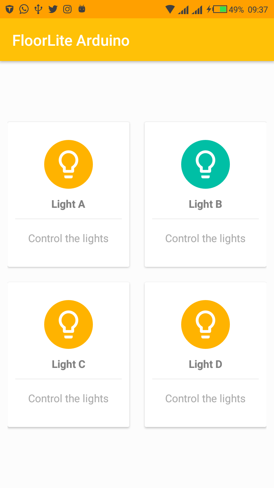

# Arduino FloorLite

🚨 ☁ 🔥 Build your own device that controls LEDs/Lights in different floors using Android, Arduino and Firebase 

Screenshot

Image
-----

Setup Requirements
----------------

- Android Things
- Firebase Database & auth
- Android
- Android Studio

Getting Started
----------------

In order to get the app running yourself, you need to:

1.  Assemble the hardware components
2.  Import the project into Android Studio
3.  Connect the Edison to USB
4.  In Android Studio, click on the "Run" button.

Prototype Schematic
-------------------

Firebase
--------

To get started, you need to:

1.  Sign In to Firebase with your Google account.

2.  Click on go to console and Add a new project and then give your project a name and give your region ,this is a very important step,if you select an incorrect region then your project might not work.

3.  Head over to project settings on the right side of your console and hover to service accounts and copy your database secret note it somewhere for further usage,we'll be discussing later.

4.  Now go to develop section and head over to database , and copy the project URL it'll be of the form

https://xxxxxxxxxxxxxxxx.firebaseio.com/ -copy it.

5.  Then go to rules section and perform the following changes or simply copy it and replace it with the below code

Contributing
------------

I would ❤️  some contributions from other authors here. Just follow these steps

 - Fork this repository
 - Open a new issue with details about your blog post 
 - Add yourself as an author in `_data/authors.yml`
 - Create a new blog post in `_posts` (it's easier to copy an existing one and make your changes. Don't forget to change the author)
 - Send me a pull request with everything
 - 🤗  wait for my virtual hug

Get in touch - Let's become friends
-----------------------------------

Please feel free to contact me if you have any questions, ideas or even if you just want to say hi. I’m up for talking, exchange ideas, collaborations or consults. You can connect with me through any of the avenues listed below:

- [Twitter](https://twitter.com/Ngesa254)
- [Github](https://github.com/ngesa254)
- [Medium](https://medium.com/@ngesa254)
- [Facebook](https://web.facebook.com/marvinngesa)
- [LinkedIn](https://www.linkedin.com/in/engngesamarvin) 

Found this project useful ❤️? Support by clicking the ⭐️ button on the upper right of this page. ✌️

References
----------

- Building an Online Presence System using Firebase Realtime Database - https://firebase.googleblog.com/2013/06/how-to-build-presence-system.html
- Android Things Setup - https://developer.android.com/things/index.html
- Controlling  NODEMCU ESP8266 1.0 12E with Firebase http://www.instructables.com/id/Controlling-an-NodeMCU-ESP8266-10-12E-With-Google-/
